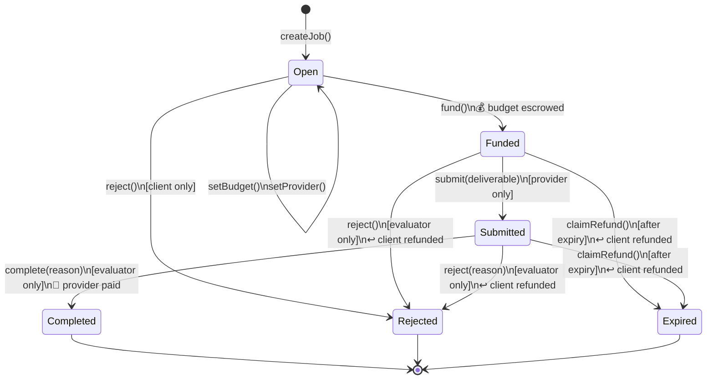
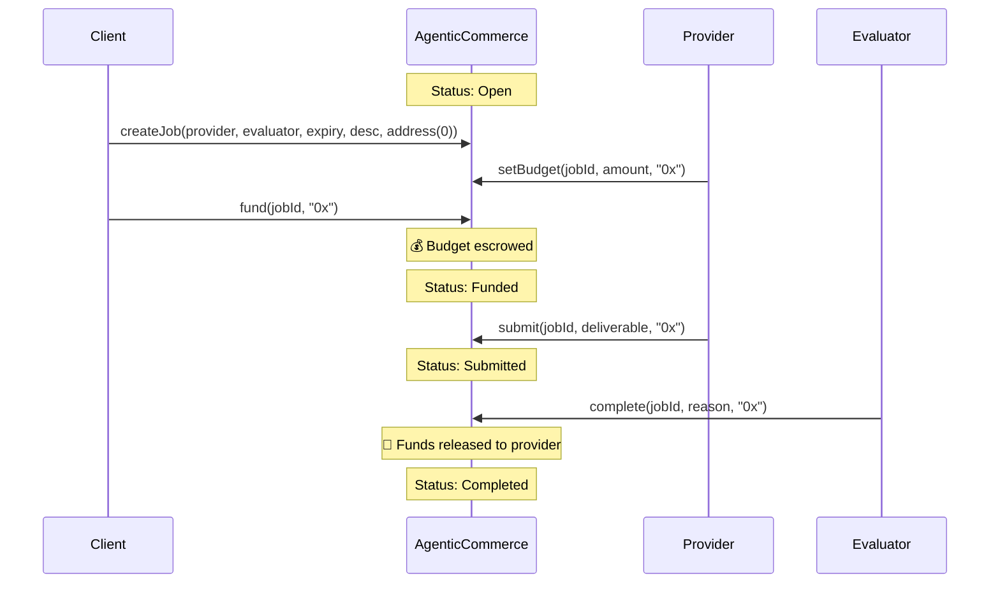
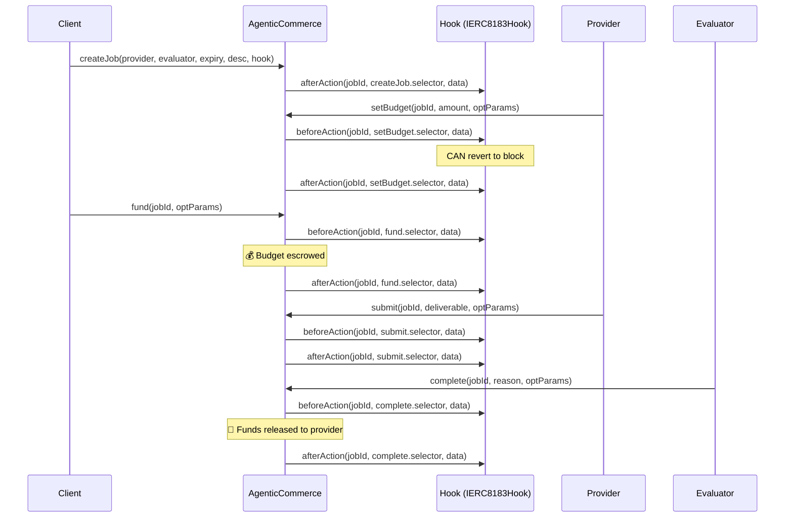

# ERC-8183 Flow Diagrams

## State Machine

```mermaid
stateDiagram-v2
    [*] --> Open: createJob()

    Open --> Open: setBudget()\nsetProvider()
    Open --> Funded: fund()\n💰 budget escrowed
    Open --> Rejected: reject()\n[client only]

    Funded --> Submitted: submit(deliverable)\n[provider only]
    Funded --> Rejected: reject()\n[evaluator only]\n↩️ client refunded
    Funded --> Expired: claimRefund()\n[after expiry]\n↩️ client refunded

    Submitted --> Completed: complete(reason)\n[evaluator only]\n💸 provider paid
    Submitted --> Rejected: reject(reason)\n[evaluator only]\n↩️ client refunded
    Submitted --> Expired: claimRefund()\n[after expiry]\n↩️ client refunded

    Completed --> [*]
    Rejected --> [*]
    Expired --> [*]
```

## Sequence — Typical Job Flow (No Hook)

```mermaid
sequenceDiagram
    participant C as Client
    participant AC as AgenticCommerce
    participant P as Provider
    participant E as Evaluator

    Note over AC: Status: Open
    C->>AC: createJob(provider, evaluator, expiry, desc, address(0))
    P->>AC: setBudget(jobId, amount, "0x")
    C->>AC: fund(jobId, "0x")
    Note over AC: 💰 Budget escrowed
    Note over AC: Status: Funded

    P->>AC: submit(jobId, deliverable, "0x")
    Note over AC: Status: Submitted

    E->>AC: complete(jobId, reason, "0x")
    Note over AC: 💸 Funds released to provider
    Note over AC: Status: Completed
```

## Sequence — Job with Hook

```mermaid
sequenceDiagram
    participant C as Client
    participant AC as AgenticCommerce
    participant H as Hook (IERC8183Hook)
    participant P as Provider
    participant E as Evaluator

    C->>AC: createJob(provider, evaluator, expiry, desc, hook)
    AC->>H: afterAction(jobId, createJob.selector, data)

    P->>AC: setBudget(jobId, amount, optParams)
    AC->>H: beforeAction(jobId, setBudget.selector, data)
    Note over H: CAN revert to block
    AC->>H: afterAction(jobId, setBudget.selector, data)

    C->>AC: fund(jobId, optParams)
    AC->>H: beforeAction(jobId, fund.selector, data)
    Note over AC: 💰 Budget escrowed
    AC->>H: afterAction(jobId, fund.selector, data)

    P->>AC: submit(jobId, deliverable, optParams)
    AC->>H: beforeAction(jobId, submit.selector, data)
    AC->>H: afterAction(jobId, submit.selector, data)

    E->>AC: complete(jobId, reason, optParams)
    AC->>H: beforeAction(jobId, complete.selector, data)
    Note over AC: 💸 Funds released to provider
    AC->>H: afterAction(jobId, complete.selector, data)
```
