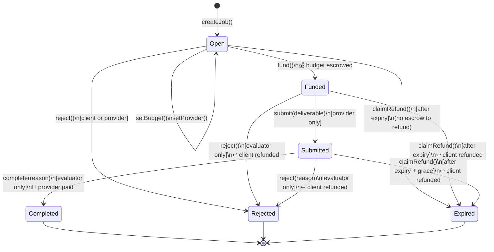
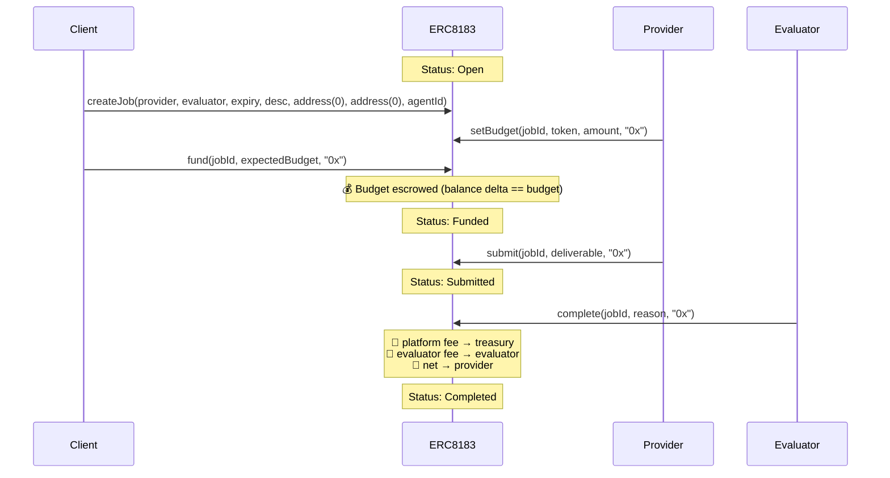
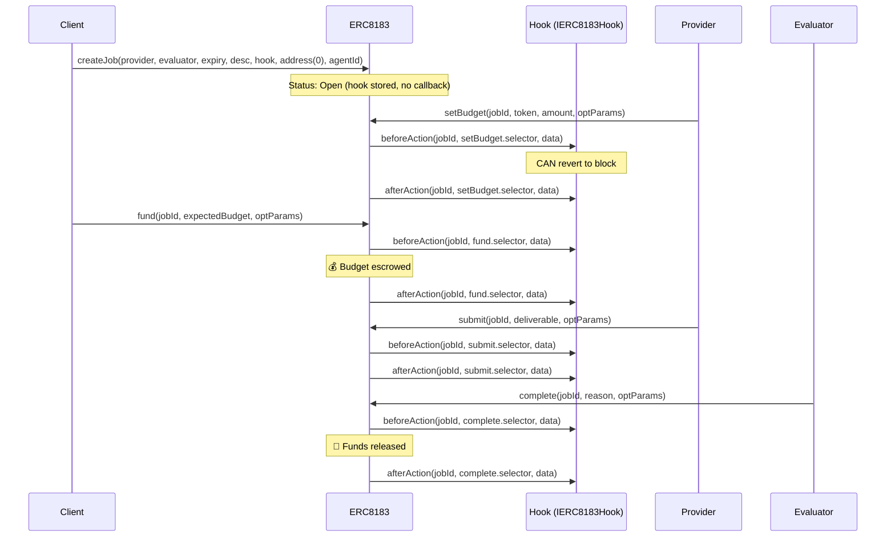
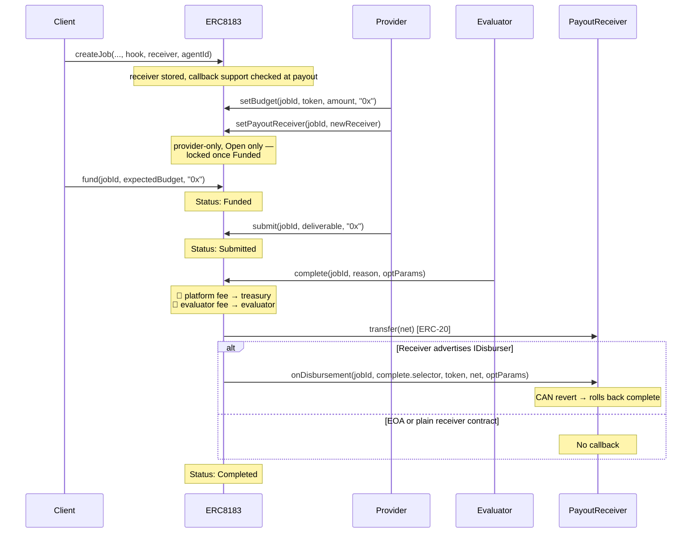

# ERC-8183 Flow Diagrams

## State Machine

After expiry, `claimRefund` is callable by anyone. For `Submitted` jobs, it is gated by an additional `EVALUATION_GRACE_PERIOD` (1 hour) so that an evaluator who is mid-review cannot be censored by a third-party refund call.

## Sequence — Typical Job Flow (No Hook)

## Sequence — Job with Hook

`createJob` is not hookable in the reference implementation — the hook is stored on the job but no callbacks fire on creation. Hooks begin firing on `setBudget`.

## Sequence — Job with Payout Receiver

`payoutReceiver` separates provider authorization from provider-side payout custody. If unset, ACP pays the provider. If set, ACP pays the receiver.

- Receivers can be EOAs, smart accounts, or contracts.
- Contracts advertising `IDisburser` via ERC-165 receive `onDisbursement` after payout.
- The provider can update the receiver while the job is `Open`; it is locked once `Funded`.
- Refunds and platform/evaluator fee routing are unchanged.

When supported, `onDisbursement` runs after the ERC-20 transfer, so receiver contracts can split funds they already control without `transferFrom` allowances.
