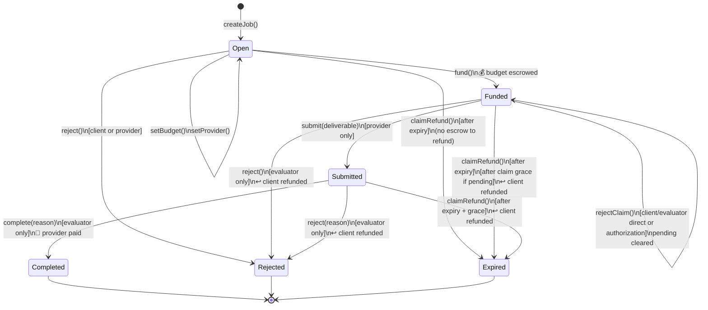
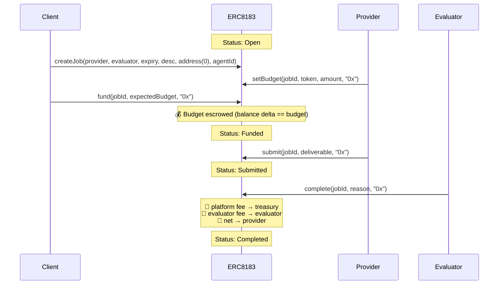
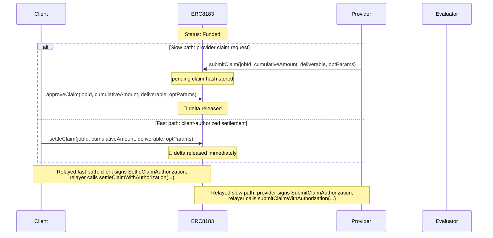
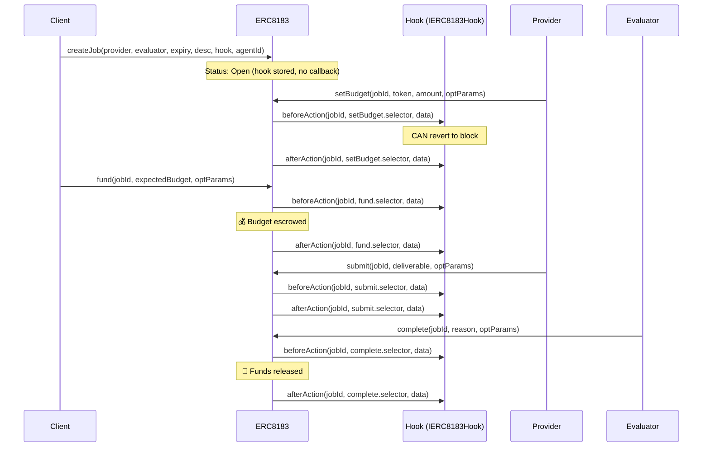

# ERC-8183 Flow Diagrams

## State Machine

Claims have separate slow and fast paths while the job remains `Funded`. In the slow path, the provider calls `submitClaim` or signs `submitClaimWithAuthorization` before expiry to record a pending nonzero-deliverable claim. The client or evaluator then approves or rejects it, directly or through `approveClaimWithAuthorization` / `rejectClaimWithAuthorization`. In the fast path, the client calls `settleClaim` or signs `settleClaimWithAuthorization` before expiry to release the new cumulative delta immediately. Both paths settle only `cumulativeAmount - settledAmount`. If the provider later calls `submit` for the final deliverable, that submission supersedes any pending claim and clears it because the provider is requesting the full remaining escrow through the normal completion path.

After expiry, `claimRefund` is callable by anyone. For `Submitted` jobs, it is gated by an additional `EVALUATION_GRACE_PERIOD` (1 hour) so that an evaluator who is mid-review cannot be censored by a third-party refund call. For pending provider claims, refund is gated by `CLAIM_RESOLUTION_GRACE_PERIOD` (1 hour); during that window no new claims can be opened, but the existing claim can still be approved or rejected. Refunds, claim settlements, and final completion only use the unsettled escrow balance, so funds released by claims are not double-paid or double-refunded.

`ERC8183WithAuthorization` uses the same EIP-712 domain as the base protocol: name `ERC8183`, version `1`. The authorization contract extends ERC8183 entrypoints rather than creating a separate signing domain; upgraded proxies can call `initializeAuthorizationV2()` during `upgradeToAndCall` to initialize EIP-712 storage when the prior implementation did not already do so.

## Sequence — Typical Job Flow (No Hook)

## Sequence — Claim Settlement

## Sequence — Job with Hook

`createJob` is not hookable in the reference implementation — the hook is stored on the job but no callbacks fire on creation. Hooks begin firing on `setBudget`.

