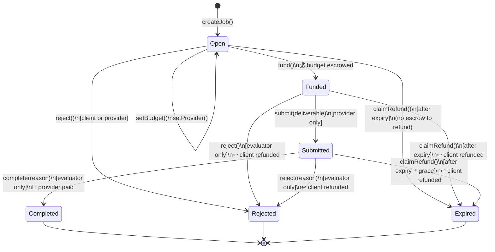
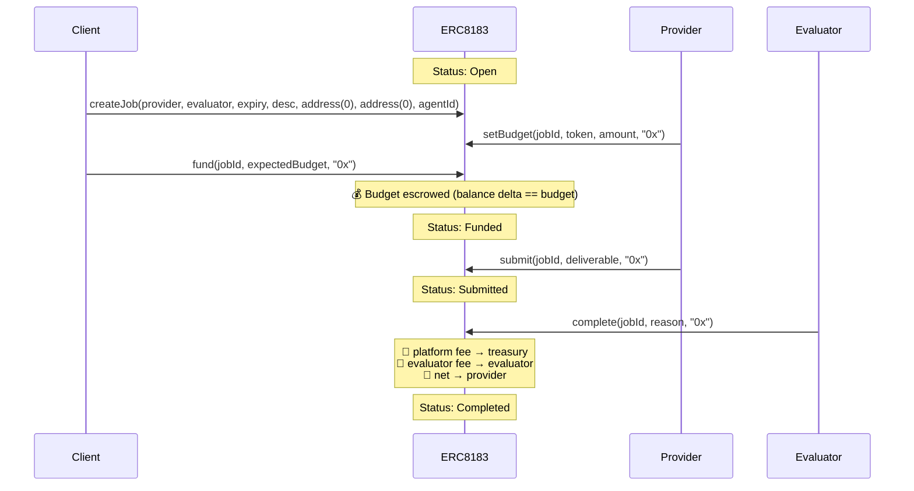
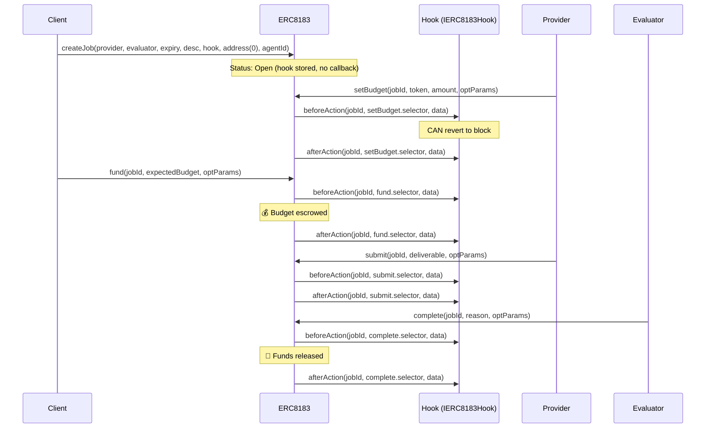
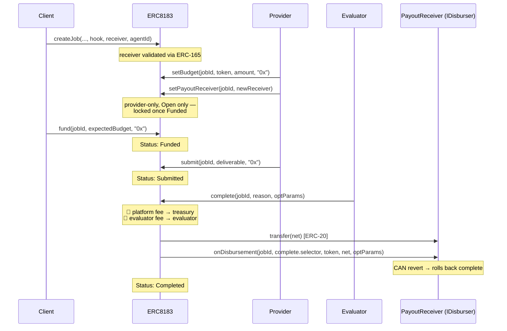

# ERC-8183 Flow Diagrams

## State Machine

After expiry, `claimRefund` is callable by anyone. For `Submitted` jobs, it is gated by an additional `EVALUATION_GRACE_PERIOD` (1 hour) so that an evaluator who is mid-review cannot be censored by a third-party refund call.

## Sequence — Typical Job Flow (No Hook)

## Sequence — Job with Hook

`createJob` is not hookable in the reference implementation — the hook is stored on the job but no callbacks fire on creation. Hooks begin firing on `setBudget`.

## Sequence — Job with Payout Receiver

`payoutReceiver` decouples the operational provider from the wallet that actually receives the provider-side net payout. Use it to route payouts to a treasury, multisig, or a splitter contract that performs custom downstream disbursement (e.g. when ACP platform/evaluator fees are set to zero and all fee logic lives downstream).

- The receiver **must be a contract that advertises `IDisburser` via ERC-165**. EOAs and contracts that don't implement the interface are rejected at `createJob` / `setPayoutReceiver`.
- Set initially by the client at `createJob`. The **provider** can update it via `setPayoutReceiver` while the job is `Open`; once `Funded` the receiver is locked.
- When `payoutReceiver == address(0)` (default), behavior is unchanged: ACP pays the provider directly and no callback fires.
- When `payoutReceiver != address(0)`, ACP transfers the provider-side net to the receiver and **strictly** invokes `onDisbursement(jobId, msg.sig, token, amount, optParams)`. A revert in the receiver propagates and rolls back the entire `complete` call.
- Refunds (`reject`, `claimRefund`) and platform/evaluator fee routing are unaffected.

`onDisbursement` is invoked **after** the ERC-20 transfer settles, so the receiver already controls the funds when its callback runs. This lets a splitter contract forward funds it already holds rather than pulling via `transferFrom`, removing the allowance-management overhead a hook-based splitter would require.
