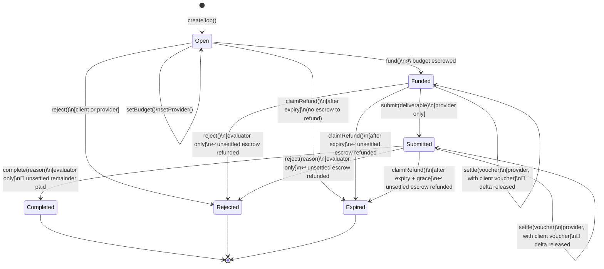
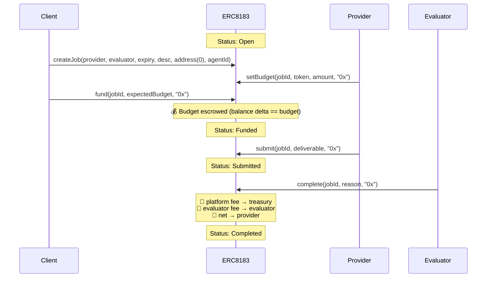
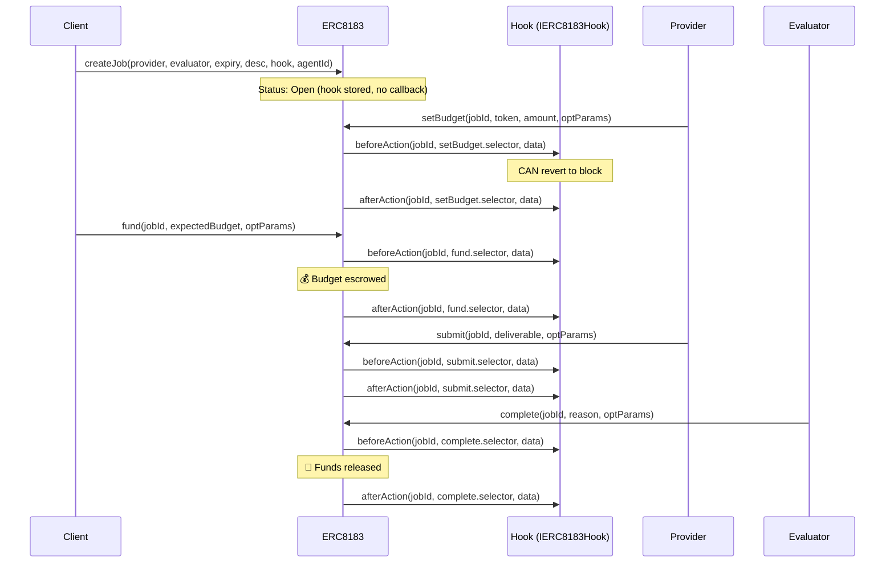
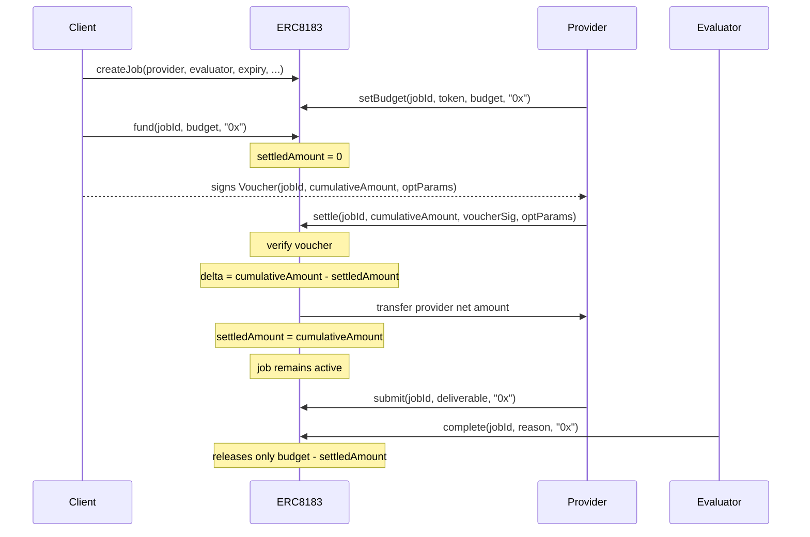

# ERC-8183 Flow Diagrams

## State Machine

After expiry, `claimRefund` is callable by anyone. For `Submitted` jobs, it is gated by an additional `EVALUATION_GRACE_PERIOD` (1 hour) so that an evaluator who is mid-review cannot be censored by a third-party refund call.

`settle` is an in-place self-transition: it releases an incremental portion of the escrow against a client-signed voucher without changing the job's status. The cumulative amount released is tracked in `Job.settledAmount`. `complete`, `reject`, and `claimRefund` always net `settledAmount` out of the budget, so already-released funds are never double-paid or double-refunded.

## Sequence — Typical Job Flow (No Hook)

## Sequence — Job with Hook

`createJob` is not hookable in the reference implementation — the hook is stored on the job but no callbacks fire on creation. Hooks begin firing on `setBudget`.

## Sequence — Partial Settlement (Voucher)

`settle` lets the provider draw client-authorized incremental payments while a job is still active (`Funded` or `Submitted`). The client signs an EIP-712 `Voucher` off-chain that authorizes a **monotonically increasing cumulative amount**; on-chain the contract releases only the delta against the prior `settledAmount`. The job stays in its current status — settlement does not finalize the job.

Provider can `settle` repeatedly with successively larger `cumulativeAmount` values until either:

- the cumulative reaches `budget` (job is fully drawn), or
- the evaluator finalizes via `complete` — which then releases only `budget − settledAmount` (with fees on that remainder), or
- the job ends via `reject` / `claimRefund` — which refund only `budget − settledAmount` to the client.

**Reverts**

| Condition | Error |
| --- | --- |
| Caller is not `job.provider` | `Unauthorized` |
| Job not in `Funded` or `Submitted` | `WrongStatus` |
| `block.timestamp >= job.expiredAt` | `WrongStatus` |
| `cumulativeAmount <= settledAmount` | `NoNewSettlement` |
| `cumulativeAmount > job.budget` | `ExceedsBudget` |
| Voucher signature does not recover to `job.client` | `InvalidVoucherSignature` |

**Hook interaction.** When a hook is attached, `settle` fires `beforeAction` / `afterAction` with `selector = settle.selector` and `data = abi.encode(provider, delta, optParams)`. Because the client signs over `optParams`, hooks can rely on those parameters being client-authorized.

**Voucher encoding.** The voucher binds `(jobId, cumulativeAmount, optParams)` under the EIP-712 domain `("ERC8183", "1", chainId, verifyingContract)`. Signature verification goes through `SignatureChecker`, so both EOA signatures and ERC-1271 smart-wallet signatures are supported.
