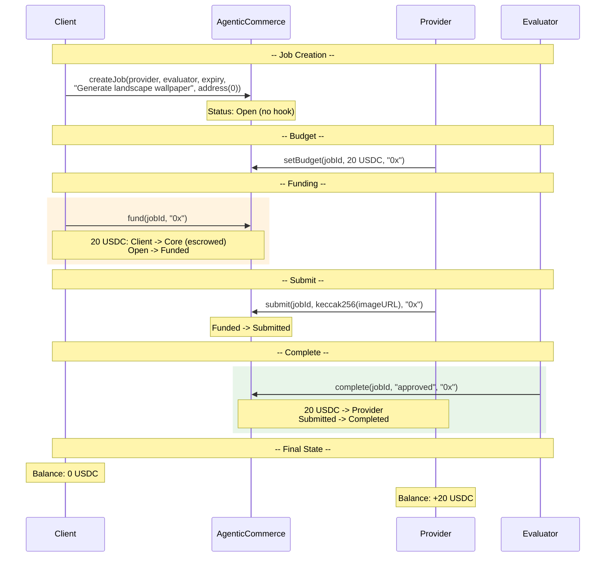

# Demo Flow Diagrams

## Demo 1: Image Generation (No Hook)

A client requests an AI-generated image. No hook is used — the core handles all USDC escrow and payment natively.

No hook involved. Pure core escrow flow.
