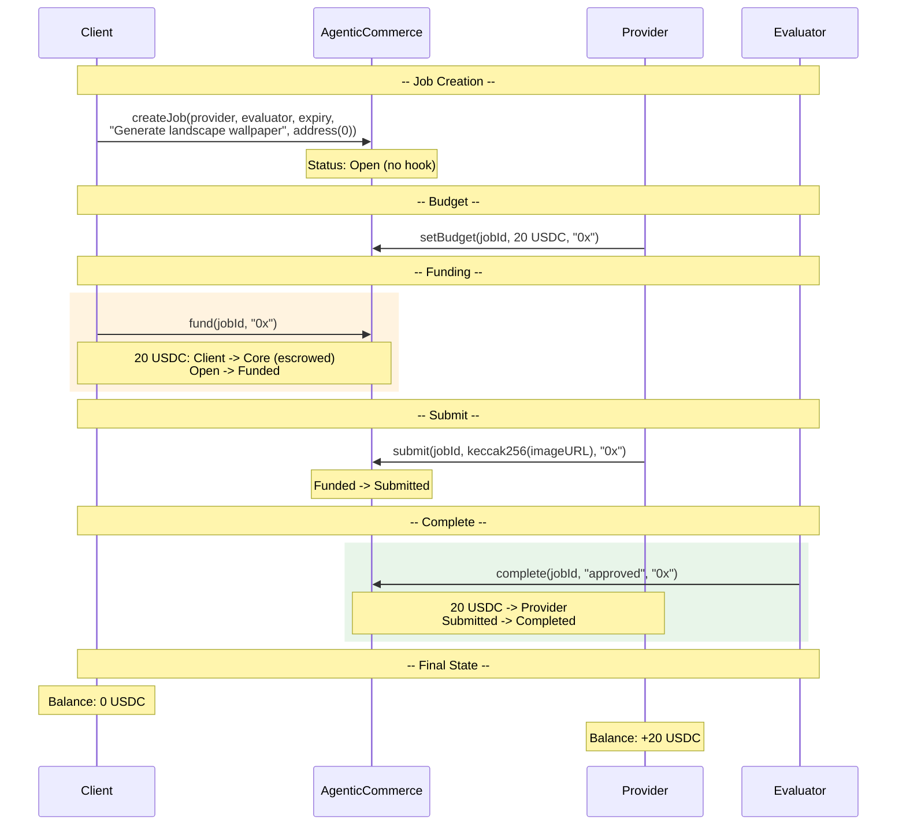
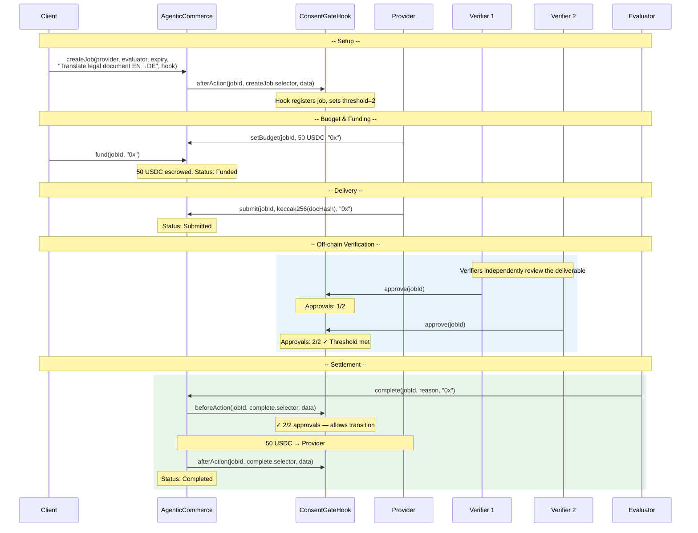

# Demo Flow Diagrams

## Demo 1: Image Generation (No Hook)

A client requests an AI-generated image. No hook is used — the core handles all USDC escrow and payment natively.

No hook involved. Pure core escrow flow.

---

## Demo 2: Consent-Gated Completion (Hook-Based)

An evaluator needs multiple independent approvals before settlement. A **ConsentGateHook** collects off-chain verification results and gates the `complete()` transition — the evaluator can only finalize once enough approvals are recorded.

This is a *non-normative* example showing one possible integration pattern for builders who need multi-party agreement before funds are released.

### Why use this pattern?

- **Quality assurance** — multiple reviewers must agree before payment settles
- **Dispute reduction** — consensus is established *before* the terminal `complete()` call, not after
- **Evaluator accountability** — the evaluator's attestation is backed by recorded verification signals
- **Composability** — the hook is a separate contract; swap it for a different consent mechanism without touching the core

### Hook behavior

| Selector | `beforeAction` | `afterAction` |
|----------|---------------|---------------|
| `complete` | ✅ Reverts unless approval threshold is met | Records finalization metadata |
| `reject` | ✅ Reverts unless rejection threshold is met | Records rejection metadata |
| All others | No-op (passes through) | No-op |

The hook only gates terminal transitions (`complete`/`reject`). All other lifecycle steps (budget, fund, submit) pass through unchanged.

### Sequence

### Key design points

1. **Hook gates, evaluator attests.** The hook enforces the consent threshold; the evaluator retains the on-chain authority to call `complete()`. Separation of verification logic from settlement authority.

2. **Verifiers are off-chain roles.** They interact only with the hook contract, not with the core. The core never needs to know how many verifiers exist or what threshold applies.

3. **`claimRefund` bypasses the hook.** Per the ERC-8183 safety model, expiry refunds are intentionally not hookable — a misbehaving hook can never trap client funds.

4. **Rejection follows the same pattern.** If verifiers flag issues, the evaluator calls `reject()`, and the hook's `beforeAction` checks that rejection evidence was recorded before allowing the refund.

### When to use this

- AI agent output verification (multiple models cross-check results)
- Multi-stakeholder approval workflows (legal review, compliance sign-off)
- Decentralized quality assurance (independent reviewers, no single point of trust)
